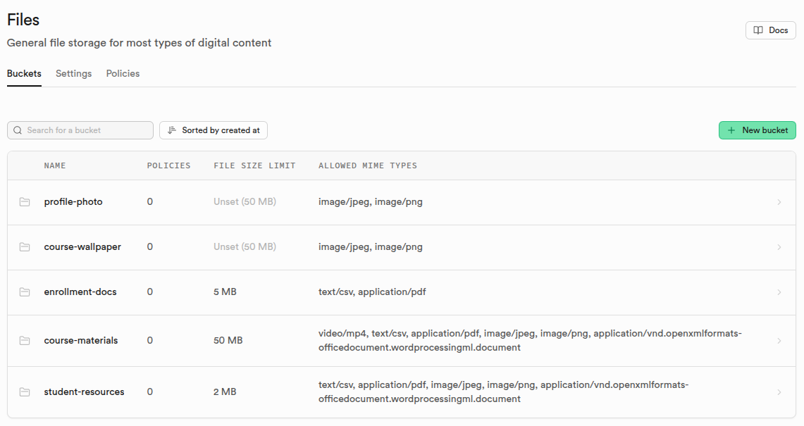
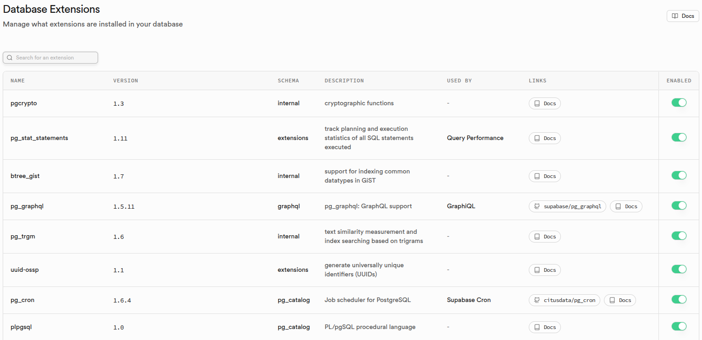
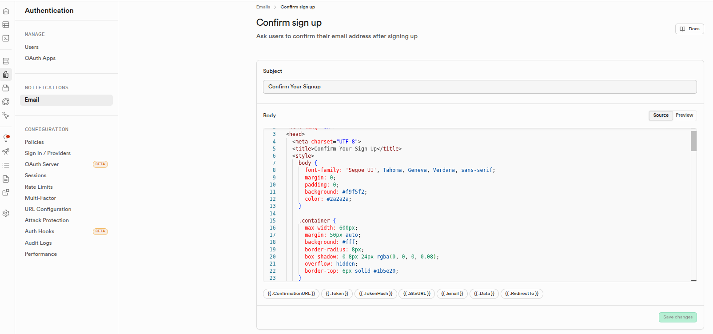
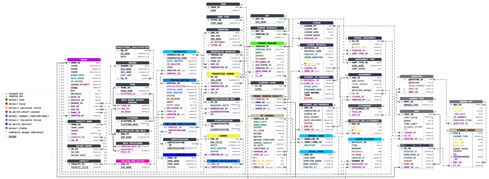

# Project Setup & Getting Started

This repository contains projects that rely on **Supabase (PostgreSQL)** and are commonly worked on using tools like **DataGrip**, **VS Code**, and modern web frameworks (e.g., Next.js, React).

This README exists because some setup steps (especially database connections) are **not obvious** and can easily fail if done incorrectly.

---
## 1. Requirements

To follow the instructions in this repository, you need the following:

### Required

#### Supabase account

* A project must already exist (empty is fine)

* You must have access to the project’s database settings

* Data API configuration:

    * Go to Project Settings → Data API

    * Ensure Exposed schemas includes only public

    * Other schemas should remain unexposed unless explicitly required
  
    * 

* Database Extensions needed:
  * Go to Database → Extensions
  * You may also need to create a new schema called "internal"
  * 
  * You may also need to create a new schema called "internal"
  * 
  
* Storage configuration:
  * Go to Storage → Files → New Bucket
    * Buckets:
      * student-resources
        * Size Limit: 2mb
        * Allowed Mime Types: text/csv, application/pdf, image/jpeg, image/png, application/vnd.openxmlformats-officedocument.wordprocessingml.document
      * course-materials
        * Size Limit: 50mb
        * Allowed Mime Types: video/mp4, text/csv, application/pdf, image/jpeg, image/png, application/vnd.openxmlformats-officedocument.wordprocessingml.document
      * enrollment-docs
        * Size Limit: 5mb
        * Allowed Mime Types: text/csv, application/pdf
      * course-wallpaper
        * Size Limit: Unset
        * Allowed Mime Types: image/jpeg, image/png
        * ##### Note Predefined/default wallpapers are needed. Please upload at least one wallpaper for courses. Samples are located in file "Read me"
      * profile-photo
        * Size Limit: 2mb
        * Allowed Mime Types: image/jpeg, image/png
        * ##### Note Predefined/default avatars are needed. Please upload at least one avatar for accounts. Samples are located in file "Read me"
    * 

* Email configuration:
  * Go to Authentication → Email
  * Change the templates of the emails. Emails templates are in Project Folder. Navigate to Read me → Email Templates.
  * 

#### DataGrip

* Used to connect to Supabase PostgreSQL

* Used to run SQL, inspect schema, and test database functions

* Establish connection which can be found directly at the upper center of Supabase's dashboard

* GitHub plugin for DataGrip
  * 
  

  
#### Git

* Required to clone this repository from GitHub

### Optional (but recommended)

#### WebStorm

* Used to test or simulate application behavior

* Helpful for validating database functions before attaching them to a backend project


## 2. Clone the Repository

```bash
https://github.com/jade-auditor/CtupiaV2.git
```

## 3. Supabase Database Connection (IMPORTANT)

Supabase provides multiple ways to connect to PostgreSQL. **Not all are suitable for GUI tools.**

### ❌ Direct Connection (Port 5432)

* Intended for backend servers and long-lived connections
* Often **blocked by networks** (school, office, VPN, ISP)
* Can silently fail in GUI tools like DataGrip

**Use only if you control the network and port 5432 is open.**

---

## 5. Recommended: Connect via Session Pooler (DataGrip)

This is the **recommended and stable method** for DataGrip.

### Supabase Dashboard

1. Go to **Project Settings → Database → Connect**
2. Select:

   * **Type:** JDBC
   * **Source:** Primary Database
   * **Method:** Session Pooler

---

### DataGrip Configuration

**General Tab**

* Host: `db.<project-ref>.supabase.co`
* Port: `6543`
* Database: `postgres`
* User: `postgres`
* Password: **Database password** (from Project Settings → Settings → Database Settings)

**SSH/SSL Tab**

* ✅ Use SSL
* Mode: `require`
* No certificates needed

This setup avoids network blocks and connection churn issues.


---

## 6. Database Password

Your database password is **NOT**:

* anon key
* service role key
* API key

Get or reset it from:

> Supabase Dashboard → Project Settings → Database → Reset Database Password

If in doubt, **reset it** and update your clients.

---

## 7. Common Connection Failures

| Problem                   | Cause             | Fix                       |
| ------------------------- | ----------------- | ------------------------- |
| Connection attempt failed | Port 5432 blocked | Use Session Pooler (6543) |
| Auth failed               | Wrong password    | Reset DB password         |
| SSL error                 | SSL disabled      | Enable SSL (require)      |
| Silent failure            | IP restrictions   | Allow IPv4 temporarily    |

---

## 8. Project Structure (Example)

```
CtupiaV2/
├─ 1.) Internal Model & Functionalities/
|       ├─ error codes.txt
|       ├─ Internal Model.sql
|       ├─ Internal Process Functionalities.sql
|       ├─ Table Datas.sql
├─ 2.) Anonymous browsing/
|       ├─ Landing Page.sql
├─ 3.) User Dashboards/
|       ├─ Module - User Dashboards [Internal].sql
|       ├─ Module - User Dashboards [Public].sql
├─ 4.) Personal Profile Settings/
|       ├─ Module - Personal Profile Settings [Internal].sql
|       ├─ Module - Personal Profile Settings [Public].sql
├─ 5.) User Account Administration/
|       ├─ Module - User Account Administration [Internal].sql
|       ├─ Module - User Account Administration [Public].sql
├─ 6.) Academic Offering Management/
|       ├─ Module - Academic Offering Management [Internal].sql
|       ├─ Module - Academic Offering Management [Public].sql
├─ 7.) Course Creator Studio/
|       ├─ Module - Course Creator Studio [Internal].sql
|       ├─ Module - Course Creator Studio [Public].sql
├─ 8.) My Learning Programs/
|       ├─ Module - My Learning Programs [Internal].sql
|       ├─ Module - My Learning Programs [Public].sql
├─ Read me/
├─ README.md
```
* #### Note: Please run the sql files based on the order of the file structure.

---
## 9. Entity Relationship Diagram


Note: All of database's stored procedures are available on your API.
Navigate to API Docs →  Stored Procedures. Stored procedures are in internal schema and has a wrapper function in Public schema. Please see the code for better understanding.

---

## 10. Notes & Warnings

* Never share database passwords
* GUI tools behave differently than backend apps
* When in doubt, prefer **poolers** over direct connections

---

## 11. Troubleshooting Checklist

Before asking for help, confirm:

* [ ] Correct Supabase project
* [ ] Database password is correct
* [ ] SSL is enabled
* [ ] Using Session Pooler for GUI tools
* [ ] Network is not blocking the port

---

## 12. Related Projects

Web App: https://github.com/airielle11/ctupia-mooc-web.git

Mobile App: https://github.com/RodnieCaracena/CTUPIA-MobileApp.git

---

## Final Note

If something "should work" but doesn’t, it’s usually **network or SSL-related**, not your code.

This README exists so future-you doesn’t have to suffer through this again.
